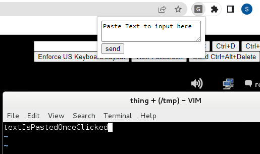

# Slower VM-Paste Extension

For specific use in Ginko, but could be modified for other uses.

# Installation

- Download this repo as a zip -> unzip it
- visit `chrome://extensions/` in chrome browser
- Turn Developer Mode on
- Click 'Load unpacked', select the uzipped folder with the files
- Click extension icon in chrome toolbar and Pin it

# Usage

- Get VM ready to paste (like normal)
- Click extension icon
- Paste text into popup
- Click `send`

# Known Bugs

- Must refresh if you want to paste something additional after

## TODO

- Better UI
- Convert to Typescript
- Fix bug (extension tries to insert script that now already exists)
- Add options in UI for adjusting speed / chunkSize
- Figure out way to 'upload file'
- Experiment with faster constants
